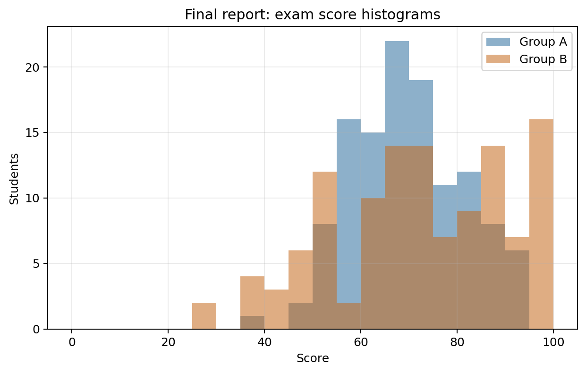
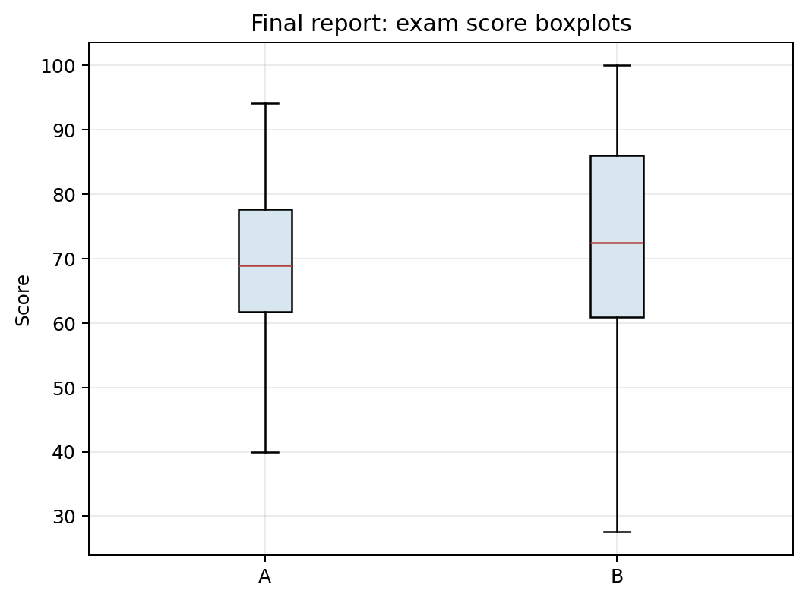
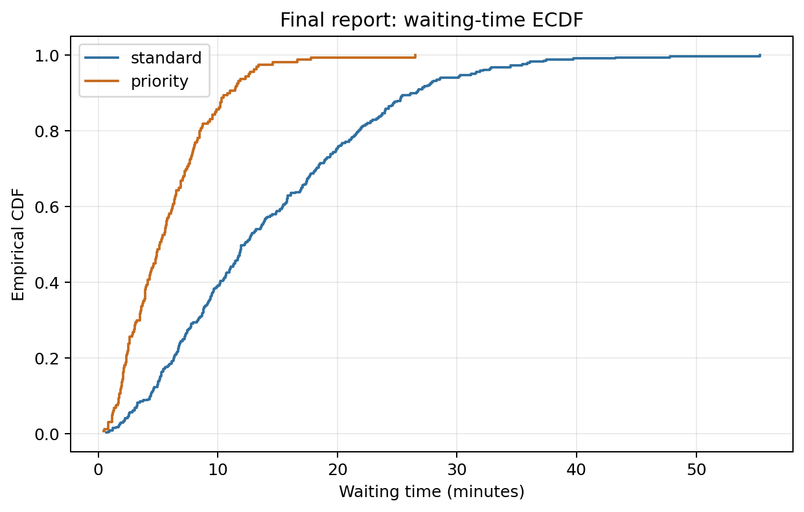
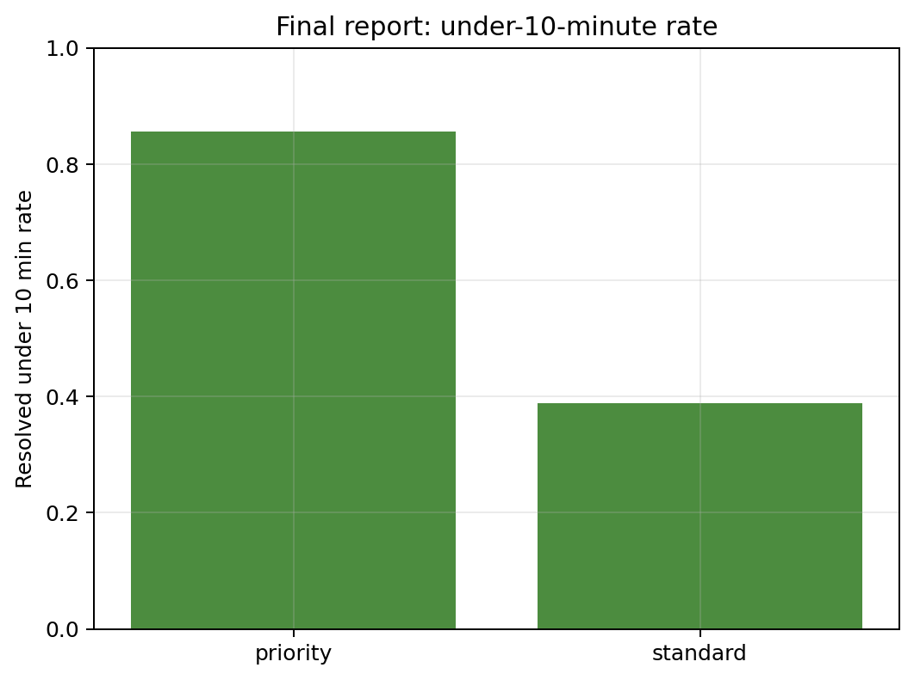
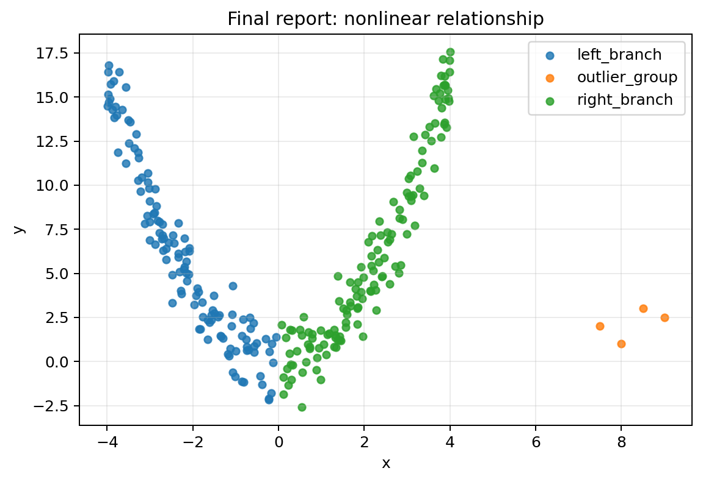
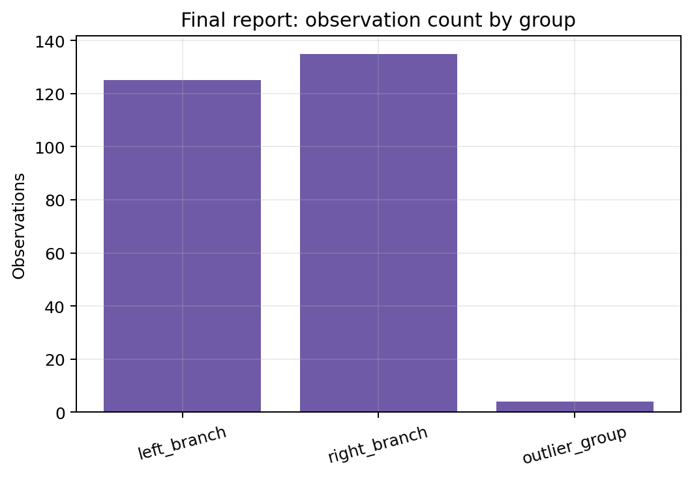

# Final Problem — Short Statistical Report

## Generated files

- Exam group frequency: [`final_p3_group_frequency.csv`](final_p3_group_frequency.csv)
- Exam group summary: [`final_p3_group_summary.csv`](final_p3_group_summary.csv)
- Exam sample variation: [`final_p3_sample_variation.csv`](final_p3_sample_variation.csv)
- Waiting-time service frequency: [`final_p8_service_frequency.csv`](final_p8_service_frequency.csv)
- Waiting-time service summary: [`final_p8_service_summary.csv`](final_p8_service_summary.csv)
- Waiting-time sample variation: [`final_p8_sample_variation.csv`](final_p8_sample_variation.csv)
- Correlation group frequency: [`final_p10_group_frequency.csv`](final_p10_group_frequency.csv)
- Correlation group summary: [`final_p10_group_summary.csv`](final_p10_group_summary.csv)
- Correlation sample variation: [`final_p10_sample_variation.csv`](final_p10_sample_variation.csv)
- Plots: PNG files in this folder.

## Visualizations

**What this shows:** The histograms compare the full score distributions in groups A and B. They show that group B has a higher center but also more spread.

**What this shows:** The boxplots support the warning that the mean is not enough: group B has higher typical scores, but also more variability and lower scores.

**What this shows:** The ECDF compares waiting-time distributions by service type. The priority curve rises faster, so priority tickets are more likely to be resolved below the same time threshold.

**What this shows:** This bar chart turns waiting times into an empirical probability: the proportion of tickets resolved within 10 minutes for each service type.

**What this shows:** The scatter plot shows a strong nonlinear U-shaped relationship that a single correlation coefficient does not describe well.

**What this shows:** This bar chart gives the group frequencies before interpreting group-level summaries and correlations.

This model report uses three datasets: exam scores, waiting times, and correlation traps. In each case, `sample_1` is the main reproducible sample. The other samples are used to check which conclusions are stable and which numerical values fluctuate.

## Dataset 1: Exam Scores

The exam-score dataset has 240 observations and 6 variables in `sample_1`. One row is one student. A frequency table for the group variable is:

| group | frequency | relative_frequency |
| --- | --- | --- |
| A | 120 | 0.5000 |
| B | 120 | 0.5000 |

A numerical summary by group is:

| group | count | mean_score | median_score | standard_deviation | pass_rate |
| --- | --- | --- | --- | --- | --- |
| A | 120 | 69.8492 | 68.9000 | 11.4975 | 0.9750 |
| B | 120 | 72.4058 | 72.4500 | 18.1090 | 0.8750 |

Group B has the higher mean and median score, but group A has the higher pass rate. This is a useful warning about misuse of numerical summaries: if “better” means higher average score, B looks better; if it means a higher proportion passing, A looks better in `sample_1`. The histogram and boxplot explain the difference because group B is more variable.

Across samples, the exact means and pass rates fluctuate:

| sample_id | group | mean_score | pass_rate |
| --- | --- | --- | --- |
| sample_1 | A | 69.8492 | 0.9750 |
| sample_1 | B | 72.4058 | 0.8750 |
| sample_2 | A | 68.7075 | 0.9500 |
| sample_2 | B | 72.8358 | 0.9167 |
| sample_3 | A | 68.5125 | 0.9750 |
| sample_3 | B | 73.9425 | 0.9083 |
| sample_4 | A | 67.1425 | 0.9333 |
| sample_4 | B | 72.6083 | 0.9083 |
| sample_5 | A | 70.1367 | 1.0000 |
| sample_5 | B | 72.8892 | 0.9333 |

## Dataset 2: Waiting Times

The waiting-time dataset has 500 observations and 6 variables in `sample_1`. One row is one service ticket. A frequency table for service type is:

| service_type | frequency | relative_frequency |
| --- | --- | --- |
| standard | 340 | 0.6800 |
| priority | 160 | 0.3200 |

A numerical summary by service type is:

| service_type | count | mean_wait | median_wait | q75 | under_10_rate |
| --- | --- | --- | --- | --- | --- |
| priority | 160 | 5.8513 | 5.1250 | 7.9425 | 0.8562 |
| standard | 340 | 14.2555 | 12.2400 | 19.9025 | 0.3882 |

The empirical probability of resolution within 10 minutes is 0.5380 overall. By service type, priority tickets are much more likely to be resolved under 10 minutes than standard tickets. The ECDF is important because it shows the whole distribution, not only one threshold.

A possible misuse would be to compare only mean waiting time and ignore skewness. Waiting times have long right tails, so medians, quantiles, ECDFs, and boxplots are more informative than the mean alone.

Across samples, the waiting-time summaries fluctuate but remain broadly similar:

| sample_id | mean_wait | median_wait | under_10_rate |
| --- | --- | --- | --- |
| sample_1 | 11.5661 | 9.2000 | 0.5380 |
| sample_2 | 11.5464 | 8.9300 | 0.5420 |
| sample_3 | 11.9291 | 9.2000 | 0.5340 |
| sample_4 | 12.7659 | 10.1550 | 0.4940 |
| sample_5 | 11.7214 | 9.0750 | 0.5380 |

## Dataset 3: Correlation Traps

The correlation-traps dataset has 264 observations and 6 variables in `sample_1`. One row is one observation with `x`, `y`, and a group label. A frequency table for the group variable is:

| group | frequency | relative_frequency |
| --- | --- | --- |
| left_branch | 125 | 0.4735 |
| right_branch | 135 | 0.5114 |
| outlier_group | 4 | 0.0152 |

A numerical summary by group is:

| group | count | mean_x | mean_y | min_y | max_y |
| --- | --- | --- | --- | --- | --- |
| left_branch | 125 | -2.1482 | 5.9510 | -2.1630 | 16.8040 |
| outlier_group | 4 | 8.2500 | 2.1250 | 1.0000 | 3.0000 |
| right_branch | 135 | 2.1446 | 6.0978 | -2.5950 | 17.5570 |

The overall correlation in `sample_1` is 0.0179. This number is misleading if interpreted alone, because the scatter plot shows a strong nonlinear U-shaped relationship. A low correlation does not mean no relationship; it means weak linear association.

Across samples, the exact correlation changes but the nonlinear visual pattern remains stable:

| sample_id | correlation |
| --- | --- |
| sample_1 | 0.0179 |
| sample_2 | -0.1679 |
| sample_3 | -0.0698 |
| sample_4 | -0.1017 |
| sample_5 | -0.0168 |

## Conclusion

These three examples show why descriptive statistics should combine tables, numerical summaries, plots, and written interpretation. Single statistics can be useful, but they can also hide spread, skewness, subgroup structure, outliers, nonlinear relationships, and sample-to-sample variation. The repeated samples make the key point visible: empirical descriptions are based on data, and data generated from the same process are similar but not identical.
