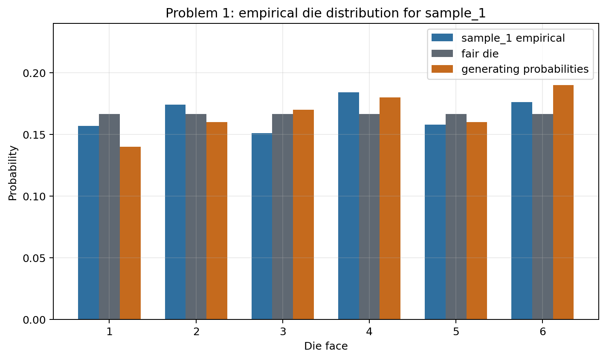
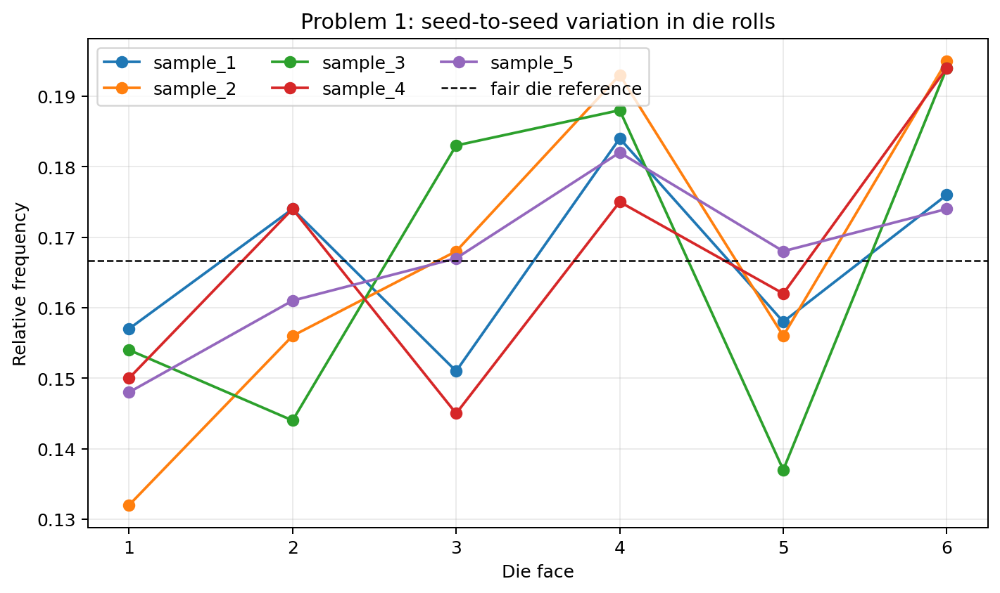

# Problem 1 — Die Rolls and Empirical Distribution

## Generated files

- Dataset: [`problem_01_die_rolls.csv`](problem_01_die_rolls.csv)
- Frequency table for `sample_1`: [`frequency_table_sample_1.csv`](frequency_table_sample_1.csv)
- Event probabilities for `sample_1`: [`event_probabilities_sample_1.csv`](event_probabilities_sample_1.csv)
- Relative frequencies by sample: [`relative_frequency_by_sample.csv`](relative_frequency_by_sample.csv)
- Event probabilities by sample: [`event_probabilities_by_sample.csv`](event_probabilities_by_sample.csv)
- Distribution plot for `sample_1`: [`empirical_distribution_sample_1.png`](empirical_distribution_sample_1.png)
- Sample comparison plot: [`relative_frequency_by_sample.png`](relative_frequency_by_sample.png)

## Visualizations

**What this shows:** This plot compares the observed relative frequencies in `sample_1` with two references: a fair die and the probabilities used to generate the data. It shows why the die should not be judged only by one theoretical line: the sample is close to the generating probabilities, but still fluctuates.

**What this shows:** This plot is the key sampling-variation check. The five lines come from the same generating process, but they are not identical. The differences between lines show that empirical frequencies change when the seed changes.

## Description

One row represents one die roll inside one generated sample. The columns `sample_id` and `seed` identify which random sample produced the row. The variable `roll` is the observed die face. The variables `is_even` and `is_at_least_5` mark two events whose empirical probabilities can be estimated from the data.

The main reproducible solution uses `sample_1`. The other samples are used to check how much the empirical description changes when the seed changes.

## Frequency Table for `sample_1`

| roll | frequency | relative_frequency | fair_die_probability | generating_probability |
| --- | --- | --- | --- | --- |
| 1.0000 | 157.0000 | 0.1570 | 0.1667 | 0.1400 |
| 2.0000 | 174.0000 | 0.1740 | 0.1667 | 0.1600 |
| 3.0000 | 151.0000 | 0.1510 | 0.1667 | 0.1700 |
| 4.0000 | 184.0000 | 0.1840 | 0.1667 | 0.1800 |
| 5.0000 | 158.0000 | 0.1580 | 0.1667 | 0.1600 |
| 6.0000 | 176.0000 | 0.1760 | 0.1667 | 0.1900 |

## Empirical Event Probabilities for `sample_1`

| event | empirical_probability | fair_die_probability |
| --- | --- | --- |
| result is even | 0.5340 | 0.5000 |
| result is at least 5 | 0.3340 | 0.3333 |
| result is equal to 6 | 0.1760 | 0.1667 |

## Answers and Interpretation

The empirical distribution in `sample_1` is close to the generating probabilities, but it is not identical to them. It is also not identical to the fair-die distribution. This is expected: empirical frequencies are computed from a finite random sample, so they fluctuate around the probabilities that generated the data.

The empirical probability of an even result is 0.5340. The empirical probability of a result at least 5 is 0.3340. The empirical probability of rolling a 6 is 0.1760.

Based only on `sample_1`, the die does not look perfectly fair. Faces 4 and 6 occur relatively often, while face 1 occurs relatively rarely. This conclusion should be cautious because one finite sample is evidence, not proof.

## Variation Across Samples

The additional samples show the central lesson of the problem: the same data-generating process gives different empirical frequency tables from seed to seed. The broad pattern is similar, but the exact relative frequency of each face changes.

| sample_id | rows | even_probability | at_least_5_probability | six_probability |
| --- | --- | --- | --- | --- |
| sample_1 | 1000 | 0.5340 | 0.3340 | 0.1760 |
| sample_2 | 1000 | 0.5440 | 0.3510 | 0.1950 |
| sample_3 | 1000 | 0.5260 | 0.3310 | 0.1940 |
| sample_4 | 1000 | 0.5430 | 0.3560 | 0.1940 |
| sample_5 | 1000 | 0.5170 | 0.3420 | 0.1740 |

This is why descriptive statistics should be interpreted as summaries of observed data, not as exact theoretical probabilities.
