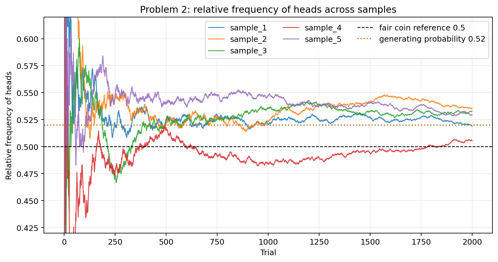
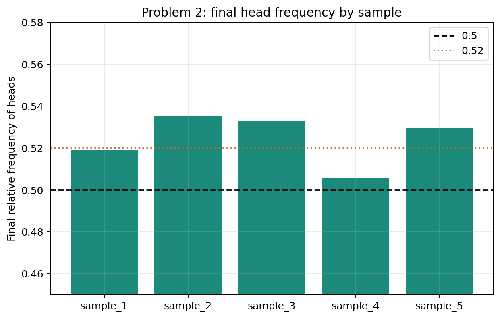

# Problem 2 — Coin Tosses and Relative Frequencies

## Generated files

- Dataset: [`problem_02_coin_tosses.csv`](problem_02_coin_tosses.csv)
- Frequency table for `sample_1`: [`frequency_table_sample_1.csv`](frequency_table_sample_1.csv)
- Relative-frequency checkpoints for `sample_1`: [`relative_frequency_checkpoints_sample_1.csv`](relative_frequency_checkpoints_sample_1.csv)
- Final relative frequencies by sample: [`final_relative_frequencies_by_sample.csv`](final_relative_frequencies_by_sample.csv)
- Relative-frequency plot: [`relative_frequency_heads_by_sample.png`](relative_frequency_heads_by_sample.png)
- Final-frequency plot: [`final_head_frequency_by_sample.png`](final_head_frequency_by_sample.png)

## Visualizations

**What this shows:** This plot shows how the running relative frequency of heads stabilizes as the number of tosses grows. Early values fluctuate strongly; later values move more slowly and tend to stay near the generating probability 0.52.

**What this shows:** This plot compares the final empirical frequency of heads across samples. The bars are close, but not equal, which illustrates the difference between theoretical probability and empirical relative frequency.

## Description

One row represents one toss in one simulated sequence of coin tosses. The column `trial` gives the running order inside a sample, and `relative_frequency_heads` records the cumulative empirical proportion of heads up to that trial.

The main reproducible solution uses `sample_1`. The other samples show how the empirical path changes when the random seed changes.

## Frequency Table for `sample_1`

| result | frequency | relative_frequency |
| --- | --- | --- |
| H | 1038 | 0.5190 |
| T | 962 | 0.4810 |

## Relative-Frequency Checkpoints for `sample_1`

| trial | cumulative_heads | relative_frequency_heads |
| --- | --- | --- |
| 10.0000 | 6.0000 | 0.6000 |
| 50.0000 | 27.0000 | 0.5400 |
| 100.0000 | 55.0000 | 0.5500 |
| 500.0000 | 262.0000 | 0.5240 |
| 1000.0000 | 521.0000 | 0.5210 |
| 2000.0000 | 1038.0000 | 0.5190 |

## Answers and Interpretation

At the beginning, the relative frequency of heads can move sharply because each new toss has a large effect on a small denominator. As the number of trials increases, the curve becomes more stable.

In `sample_1`, the final relative frequency of heads is 0.5190. It is not exactly 0.5 because empirical relative frequency is computed from observed data, while 0.5 is the theoretical probability for a fair coin.

The generated coin does not represent a perfectly fair coin: the data-generating probability of heads is 0.52. The empirical final frequency in `sample_1` is close to 0.52, but not exactly equal to it.

## Variation Across Samples

All samples are generated from the same process, but their relative-frequency curves and final values are not identical.

| sample_id | seed | trial | relative_frequency_heads | relative_frequency_tails |
| --- | --- | --- | --- | --- |
| sample_1 | 702 | 2000 | 0.5190 | 0.4810 |
| sample_2 | 1702 | 2000 | 0.5355 | 0.4645 |
| sample_3 | 2702 | 2000 | 0.5330 | 0.4670 |
| sample_4 | 3702 | 2000 | 0.5055 | 0.4945 |
| sample_5 | 4702 | 2000 | 0.5295 | 0.4705 |

This illustrates the difference between theoretical probability and empirical relative frequency: theory describes the mechanism, while empirical frequency summarizes what happened in a finite sample.
