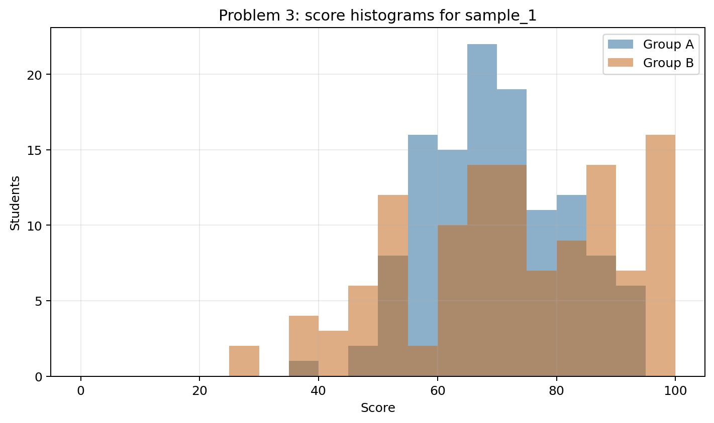
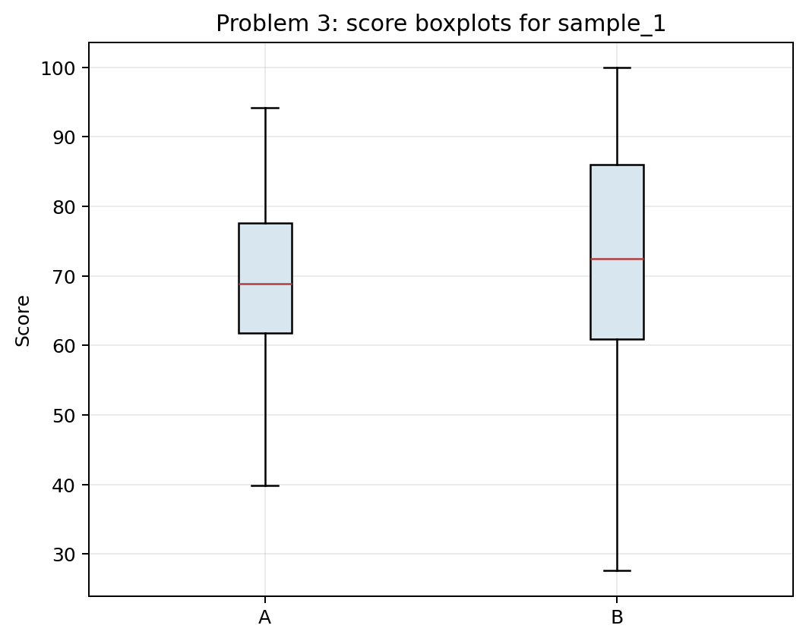
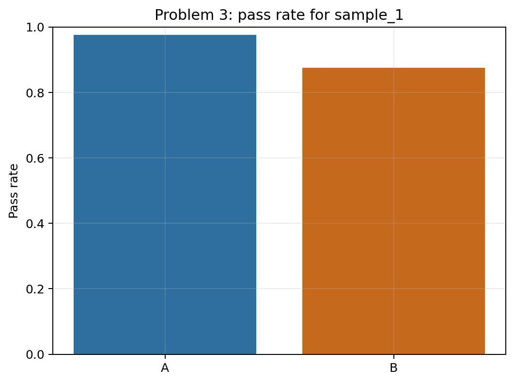
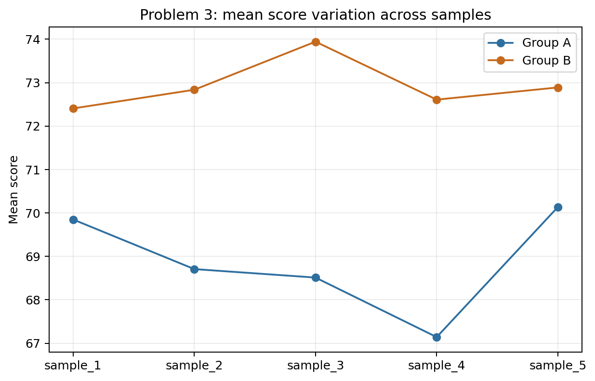

# Problem 3 — Exam Scores in Two Groups

## Generated files

- Dataset: [`problem_03_exam_scores.csv`](problem_03_exam_scores.csv)
- Overall summary for `sample_1`: [`overall_score_summary_sample_1.csv`](overall_score_summary_sample_1.csv)
- Group summary for `sample_1`: [`score_summary_by_group_sample_1.csv`](score_summary_by_group_sample_1.csv)
- Pass rate for `sample_1`: [`pass_rate_by_group_sample_1.csv`](pass_rate_by_group_sample_1.csv)
- Summary by group and sample: [`score_summary_by_group_and_sample.csv`](score_summary_by_group_and_sample.csv)
- Histograms: [`score_histograms_by_group_sample_1.png`](score_histograms_by_group_sample_1.png)
- Boxplots: [`score_boxplots_by_group_sample_1.png`](score_boxplots_by_group_sample_1.png)
- Pass-rate plot: [`pass_rate_by_group_sample_1.png`](pass_rate_by_group_sample_1.png)
- Mean-by-sample plot: [`mean_score_by_group_across_samples.png`](mean_score_by_group_across_samples.png)

## Visualizations

**What this shows:** The histograms show the full distribution of scores in both groups. They make clear that group B has a higher center but also a wider spread, so the comparison cannot be reduced to the mean alone.

**What this shows:** The boxplots summarize median, spread, and extreme values. They support the interpretation that group B performs better on average but is more variable.

**What this shows:** This plot translates scores into the practical outcome of passing. It is useful because two groups with similar averages could still have different pass rates.

**What this shows:** This plot checks whether the group comparison is stable across repeated samples. The exact mean scores change, but the main pattern can still be compared across seeds.

## Description

One row represents one student in one generated exam sample. The row records the student group, exam score, and whether the student passed.

The main reproducible analysis uses `sample_1`. The other samples show whether the comparison between groups is stable when the random sample changes.

## Overall Summary for `sample_1`

| count | mean | median | minimum | maximum | variance | standard_deviation |
| --- | --- | --- | --- | --- | --- | --- |
| 240.0000 | 71.1275 | 70.4000 | 27.6000 | 100.0000 | 230.7435 | 15.1902 |

## Group Summary for `sample_1`

| group | count | mean | median | minimum | maximum | variance | standard_deviation |
| --- | --- | --- | --- | --- | --- | --- | --- |
| A | 120 | 69.8492 | 68.9000 | 39.9000 | 94.2000 | 132.1936 | 11.4975 |
| B | 120 | 72.4058 | 72.4500 | 27.6000 | 100.0000 | 327.9367 | 18.1090 |

## Pass Rate for `sample_1`

| group | students | passed_students | pass_rate |
| --- | --- | --- | --- |
| A | 120 | 117 | 0.9750 |
| B | 120 | 105 | 0.8750 |

## Answers and Interpretation

In `sample_1`, group B has the higher mean score. Group B has the larger standard deviation.

Comparing only the means may be misleading because the groups differ not only in center but also in spread. A group with a higher mean can also have more variable results, more low scores, or more extreme high scores. The histograms and boxplots show distribution shape, spread, and possible asymmetry more clearly than a single average.

Overall, the conclusion is mixed. Group B has the higher mean and median, but group A has the higher pass rate in `sample_1`. A model answer should therefore not declare one group simply “better” without explaining the criterion. The answer should use more than one statistic: mean, median, standard deviation, pass rate, and the plots.

## Variation Across Samples

The direction of the comparison is mostly stable: group B usually has the higher mean. The exact numerical gap and pass rates change from sample to sample.

| sample_id | group | mean_score | median_score | standard_deviation | pass_rate |
| --- | --- | --- | --- | --- | --- |
| sample_1 | A | 69.8492 | 68.9000 | 11.4975 | 0.9750 |
| sample_1 | B | 72.4058 | 72.4500 | 18.1090 | 0.8750 |
| sample_2 | A | 68.7075 | 66.9500 | 12.8449 | 0.9500 |
| sample_2 | B | 72.8358 | 73.8500 | 15.7760 | 0.9167 |
| sample_3 | A | 68.5125 | 68.6500 | 11.5207 | 0.9750 |
| sample_3 | B | 73.9425 | 73.9000 | 17.6038 | 0.9083 |
| sample_4 | A | 67.1425 | 66.7500 | 11.1528 | 0.9333 |
| sample_4 | B | 72.6083 | 72.0000 | 17.1517 | 0.9083 |
| sample_5 | A | 70.1367 | 70.2500 | 10.1291 | 1.0000 |
| sample_5 | B | 72.8892 | 72.9500 | 15.3348 | 0.9333 |

This illustrates that descriptive statistics summarize one observed sample. Stable conclusions are stronger when they persist across repeated samples.
