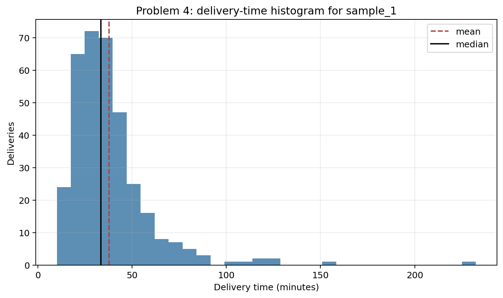
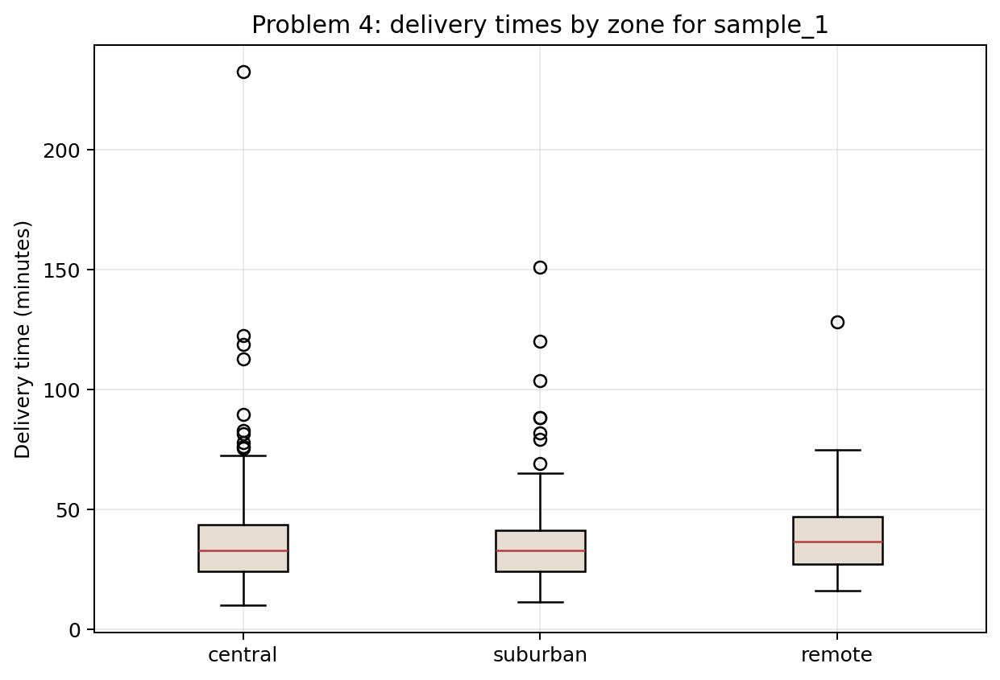
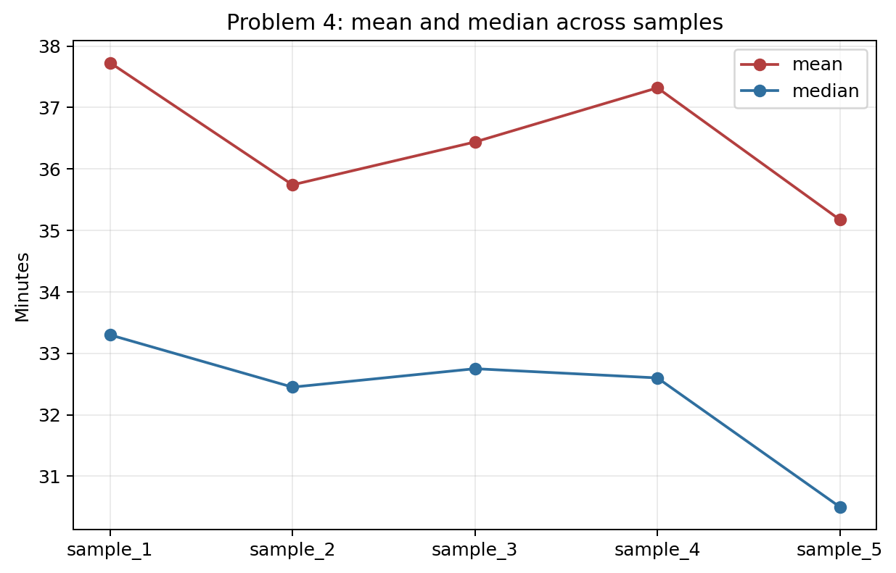

# Problem 4 — Delivery Times, Skewness, and Outliers

## Generated files

- Dataset: [`problem_04_delivery_times.csv`](problem_04_delivery_times.csv)
- Summary for `sample_1`: [`delivery_time_summary_sample_1.csv`](delivery_time_summary_sample_1.csv)
- Zone summary for `sample_1`: [`delivery_time_summary_by_zone_sample_1.csv`](delivery_time_summary_by_zone_sample_1.csv)
- IQR outliers for `sample_1`: [`outliers_1_5_iqr_sample_1.csv`](outliers_1_5_iqr_sample_1.csv)
- Delayed proportion for `sample_1`: [`delayed_proportion_sample_1.csv`](delayed_proportion_sample_1.csv)
- Summary by sample: [`delivery_time_summary_by_sample.csv`](delivery_time_summary_by_sample.csv)
- Histogram: [`delivery_time_histogram_sample_1.png`](delivery_time_histogram_sample_1.png)
- Boxplot by zone: [`delivery_time_boxplot_by_zone_sample_1.png`](delivery_time_boxplot_by_zone_sample_1.png)
- Mean/median sample plot: [`mean_median_by_sample.png`](mean_median_by_sample.png)

## Visualizations

**What this shows:** The histogram shows the right-skewed shape of delivery times. Most deliveries are moderate, while a smaller number of long deliveries stretch the right tail and pull the mean above the median.

**What this shows:** The boxplot compares delivery-time distributions between zones. It shows differences in center, spread, and possible outliers more clearly than a table of means alone.

**What this shows:** This plot shows that the mean and median fluctuate from sample to sample. The mean is consistently above the median, which confirms that skewness is a stable feature, not an accident of one sample.

## Description

One row represents one delivery in one generated sample. It records the delivery zone, the delivery time in minutes, and whether the delivery was delayed.

The main reproducible solution uses `sample_1`. The other samples help check whether skewness, outliers, and delay rates are stable features of the data-generating process.

## Summary for `sample_1`

| count | mean | median | minimum | q1 | q2_median | q3 | maximum | variance | standard_deviation |
| --- | --- | --- | --- | --- | --- | --- | --- | --- | --- |
| 350.0000 | 37.7300 | 33.3000 | 10.0000 | 24.6250 | 33.3000 | 43.7750 | 232.5000 | 494.5839 | 22.2392 |

## Quartiles and IQR Rule for `sample_1`

| q1 | q2_median | q3 | iqr | lower_fence | upper_fence | outlier_count |
| --- | --- | --- | --- | --- | --- | --- |
| 24.6250 | 33.3000 | 43.7750 | 19.1500 | -4.1000 | 72.5000 | 20.0000 |

## Zone Summary for `sample_1`

| zone | deliveries | mean | median | q1 | q3 | standard_deviation | delayed_rate |
| --- | --- | --- | --- | --- | --- | --- | --- |
| central | 154 | 38.6864 | 33.0000 | 24.0500 | 43.8000 | 25.3375 | 0.1169 |
| remote | 56 | 39.1679 | 36.4500 | 27.1000 | 46.8500 | 18.5686 | 0.0893 |
| suburban | 140 | 36.1029 | 33.0500 | 24.3500 | 41.4000 | 19.8546 | 0.0857 |

## Answers and Interpretation

The mean delivery time is larger than the median. This happens because the distribution is right-skewed: most deliveries are moderate, but a few unusually long deliveries pull the mean upward.

The 1.5 IQR rule identifies observations above 72.5000 minutes as possible high outliers. These are not necessarily data errors; they are deliveries that are unusually long relative to the middle 50% of the data.

The delayed-delivery proportion in `sample_1` is 0.1000. The median is often more informative than the mean in this dataset because it is less affected by very long delivery times.

## Delayed Deliveries

| delayed_deliveries | total_deliveries | proportion_delayed |
| --- | --- | --- |
| 35.0000 | 350.0000 | 0.1000 |

## Variation Across Samples

The right-skewed shape is stable across samples, but the exact mean, median, outlier cutoff, and delayed rate change. This is especially visible for outliers, because extreme observations are strongly sample-dependent.

| sample_id | mean | median | q1 | q3 | standard_deviation | delayed_rate |
| --- | --- | --- | --- | --- | --- | --- |
| sample_1 | 37.7300 | 33.3000 | 24.6250 | 43.7750 | 22.2392 | 0.1000 |
| sample_2 | 35.7423 | 32.4500 | 24.9250 | 41.5500 | 16.6651 | 0.0800 |
| sample_3 | 36.4397 | 32.7500 | 24.5000 | 42.2750 | 19.7337 | 0.0886 |
| sample_4 | 37.3206 | 32.6000 | 25.0250 | 43.6250 | 21.3082 | 0.0771 |
| sample_5 | 35.1740 | 30.5000 | 23.7250 | 40.7750 | 18.6007 | 0.0714 |
