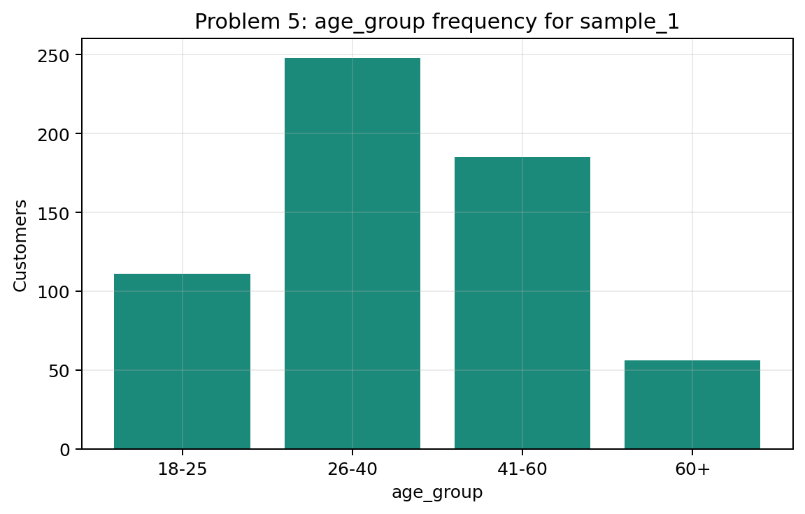
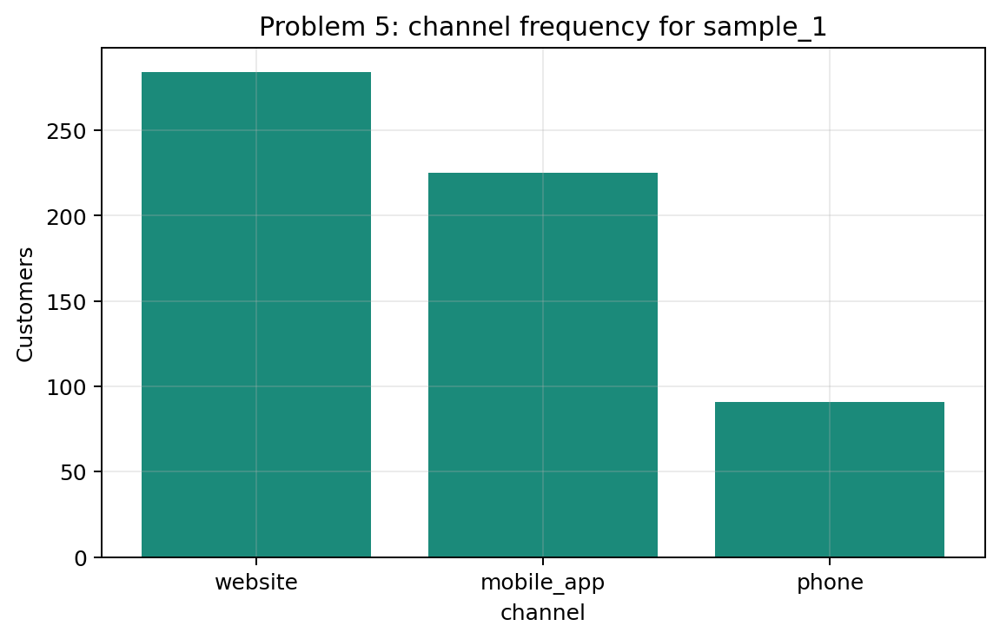
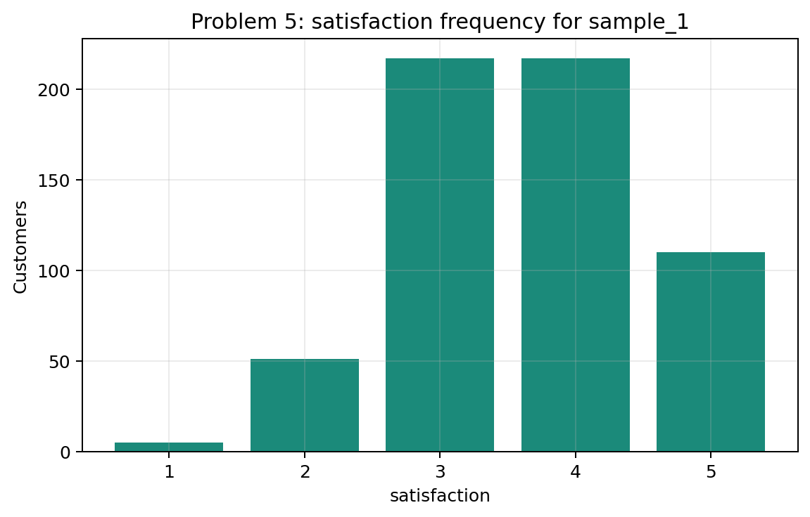
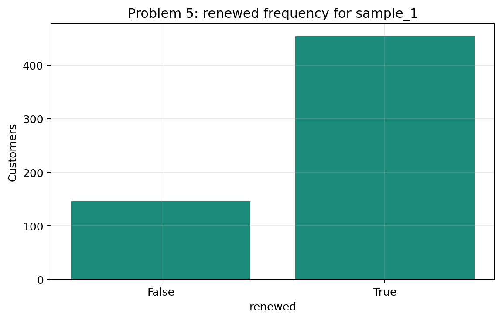
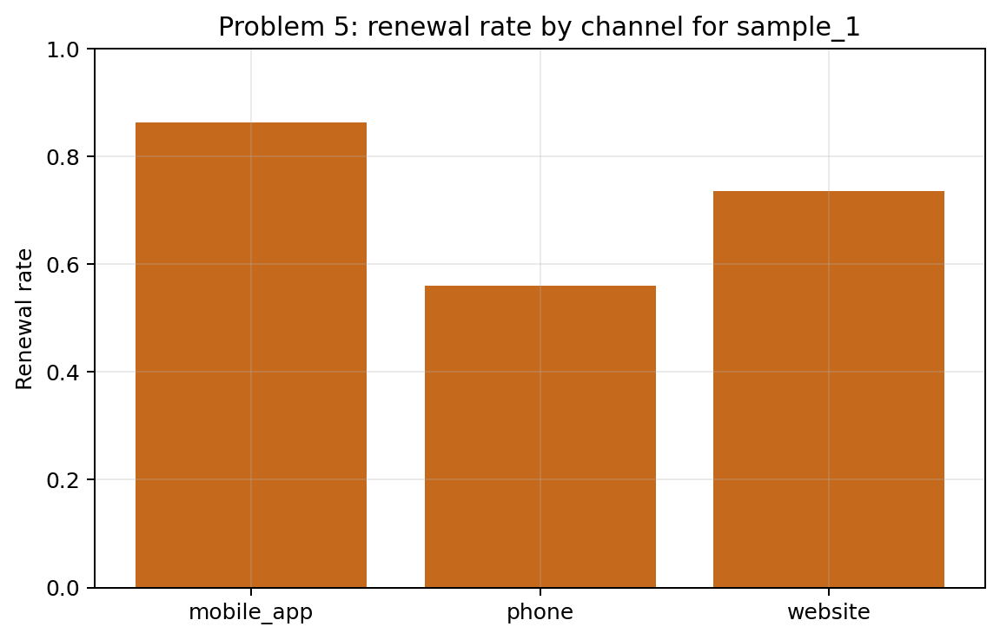
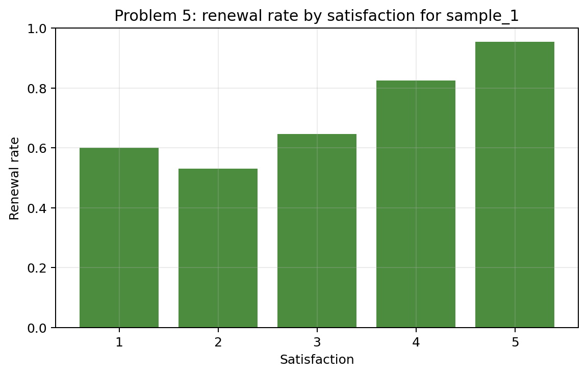
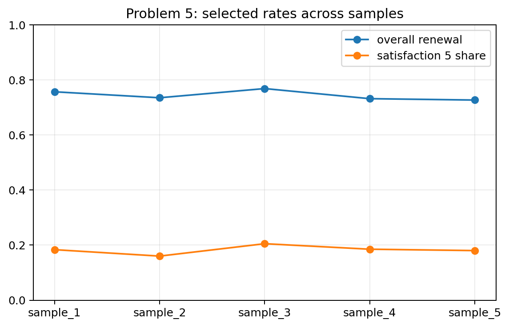

# Problem 5 — Customer Survey and Conditional Frequencies

## Generated files

- Dataset: [`problem_05_customer_survey.csv`](problem_05_customer_survey.csv)
- Age-group frequency: [`frequency_age_group_sample_1.csv`](frequency_age_group_sample_1.csv)
- Channel frequency: [`frequency_channel_sample_1.csv`](frequency_channel_sample_1.csv)
- Satisfaction frequency: [`frequency_satisfaction_sample_1.csv`](frequency_satisfaction_sample_1.csv)
- Renewed frequency: [`frequency_renewed_sample_1.csv`](frequency_renewed_sample_1.csv)
- Conditional probabilities: [`conditional_probabilities_sample_1.csv`](conditional_probabilities_sample_1.csv)
- Renewal by channel: [`renewal_rate_by_channel_sample_1.csv`](renewal_rate_by_channel_sample_1.csv)
- Renewal by satisfaction: [`renewal_rate_by_satisfaction_sample_1.csv`](renewal_rate_by_satisfaction_sample_1.csv)
- Renewal summary by sample: [`renewal_summary_by_sample.csv`](renewal_summary_by_sample.csv)
- Frequency and renewal plots: PNG files in this folder.

## Visualizations

**What this shows:** This bar chart shows the composition of the sample by age group. It helps interpret later conditional frequencies because subgroup sizes are not equal.

**What this shows:** This plot shows how customers are distributed across channels. It gives context for comparing renewal rates by channel.

**What this shows:** This plot shows the empirical distribution of satisfaction scores. It helps explain how many observations support each satisfaction-level renewal rate.

**What this shows:** This plot summarizes the overall renewal outcome. It gives a visual baseline before conditioning on channel or satisfaction.

**What this shows:** This plot compares conditional renewal rates by channel. It shows whether renewal behavior differs across customer-contact channels.

**What this shows:** This is the main explanatory plot for the problem. Renewal rate is highest at satisfaction 5 and generally rises for higher satisfaction levels; the very small satisfaction-1 group should not be overinterpreted.

**What this shows:** This plot checks sampling variation. The overall renewal rate and share of satisfaction 5 customers change across samples, so exact conditional frequencies should be treated as empirical estimates.

## Description

One row represents one surveyed customer in one generated sample. It records age group, contact channel, satisfaction score, and whether the customer renewed.

The main reproducible solution uses `sample_1`. The other samples show how conditional frequencies and renewal rates fluctuate from seed to seed.

## Frequency Tables for `sample_1`

### Age Group

| age_group | frequency | relative_frequency |
| --- | --- | --- |
| 18-25 | 111 | 0.1850 |
| 26-40 | 248 | 0.4133 |
| 41-60 | 185 | 0.3083 |
| 60+ | 56 | 0.0933 |

### Channel

| channel | frequency | relative_frequency |
| --- | --- | --- |
| website | 284 | 0.4733 |
| mobile_app | 225 | 0.3750 |
| phone | 91 | 0.1517 |

### Satisfaction

| satisfaction | frequency | relative_frequency |
| --- | --- | --- |
| 1.0000 | 5.0000 | 0.0083 |
| 2.0000 | 51.0000 | 0.0850 |
| 3.0000 | 217.0000 | 0.3617 |
| 4.0000 | 217.0000 | 0.3617 |
| 5.0000 | 110.0000 | 0.1833 |

### Renewed

| renewed | frequency | relative_frequency |
| --- | --- | --- |
| False | 146 | 0.2433 |
| True | 454 | 0.7567 |

## Conditional Probabilities for `sample_1`

| quantity | value |
| --- | --- |
| overall renewal rate | 0.7567 |
| P(renewed | satisfaction = 5) | 0.9545 |
| P(satisfaction = 5 | renewed) | 0.2313 |

## Renewal by Channel for `sample_1`

| channel | customers | renewed_customers | renewal_rate |
| --- | --- | --- | --- |
| mobile_app | 225 | 194 | 0.8622 |
| phone | 91 | 51 | 0.5604 |
| website | 284 | 209 | 0.7359 |

## Renewal by Satisfaction for `sample_1`

| satisfaction | customers | renewed_customers | renewal_rate |
| --- | --- | --- | --- |
| 1.0000 | 5.0000 | 3.0000 | 0.6000 |
| 2.0000 | 51.0000 | 27.0000 | 0.5294 |
| 3.0000 | 217.0000 | 140.0000 | 0.6452 |
| 4.0000 | 217.0000 | 179.0000 | 0.8249 |
| 5.0000 | 110.0000 | 105.0000 | 0.9545 |

## Answers and Interpretation

The overall renewal rate in `sample_1` is 0.7567. Renewal rates differ by channel, and they are much higher for satisfaction levels 4 and 5 than for levels 2 and 3. The satisfaction-1 group contains only 5 customers, so its rate is unstable and should not be used to claim a perfectly monotone pattern. Overall, the data suggest a relationship between satisfaction and renewal.

The two conditional probabilities answer different questions. `P(renewed | satisfaction = 5)` asks: among customers with satisfaction equal to 5, what proportion renewed? `P(satisfaction = 5 | renewed)` asks: among customers who renewed, what proportion had satisfaction equal to 5? These are not the same conditioning group, so the values are different.

This problem is related to conditional probability because many summaries are computed inside a subgroup, such as customers with a given satisfaction level or a given channel.

## Variation Across Samples

The positive relationship between satisfaction and renewal is stable, but exact renewal rates change across samples. This is why empirical conditional probabilities should be interpreted as sample-based estimates.

| sample_id | overall_renewal_rate | mean_satisfaction | satisfaction_5_share |
| --- | --- | --- | --- |
| sample_1 | 0.7567 | 3.6267 | 0.1833 |
| sample_2 | 0.7350 | 3.5717 | 0.1600 |
| sample_3 | 0.7683 | 3.6967 | 0.2050 |
| sample_4 | 0.7317 | 3.6083 | 0.1850 |
| sample_5 | 0.7267 | 3.6317 | 0.1800 |
