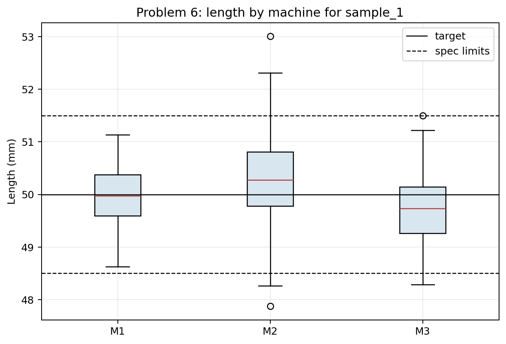
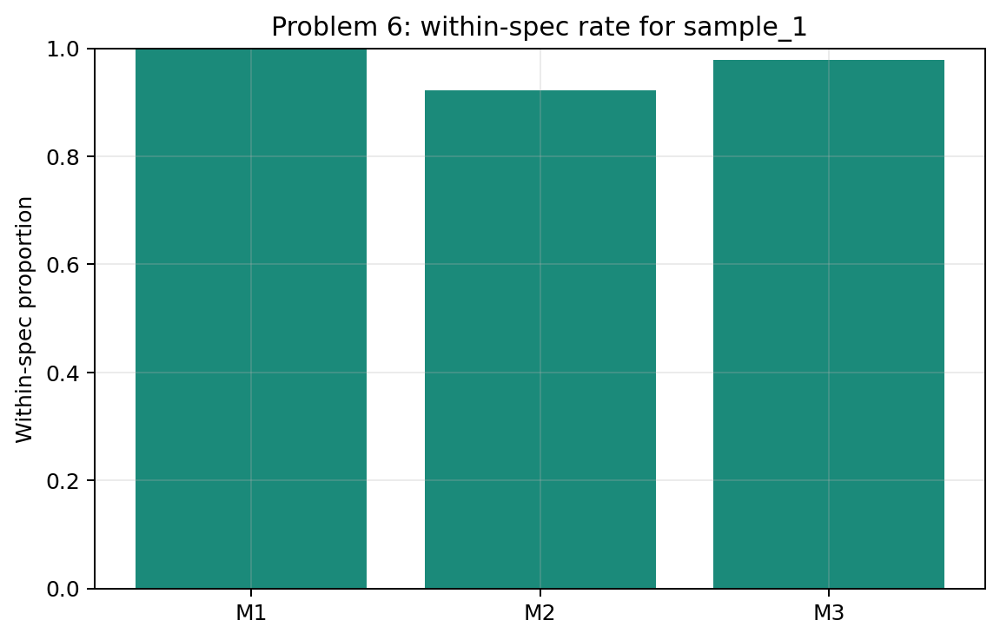
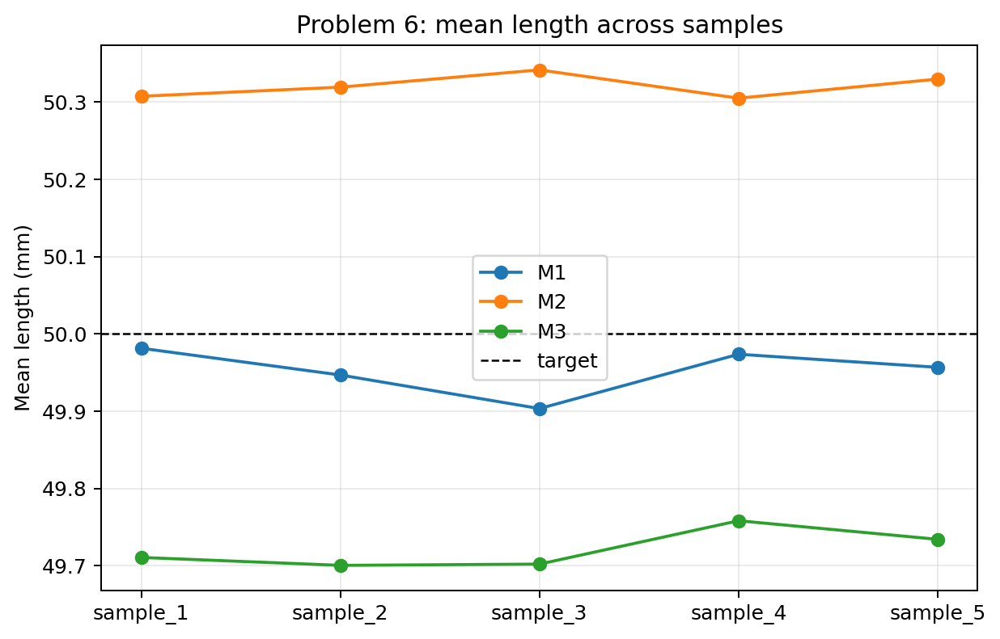

# Problem 6 — Factory Measurements and Specification Limits

## Generated files

- Dataset: [`problem_06_factory_measurements.csv`](problem_06_factory_measurements.csv)
- Overall summary for `sample_1`: [`length_summary_overall_sample_1.csv`](length_summary_overall_sample_1.csv)
- Machine summary for `sample_1`: [`length_summary_by_machine_sample_1.csv`](length_summary_by_machine_sample_1.csv)
- Within-spec table for `sample_1`: [`within_spec_by_machine_sample_1.csv`](within_spec_by_machine_sample_1.csv)
- Machine summary by sample: [`machine_summary_by_sample.csv`](machine_summary_by_sample.csv)
- Boxplots: [`length_boxplots_by_machine_sample_1.png`](length_boxplots_by_machine_sample_1.png)
- Within-spec plot: [`within_spec_proportion_by_machine_sample_1.png`](within_spec_proportion_by_machine_sample_1.png)
- Mean-by-sample plot: [`mean_length_by_machine_across_samples.png`](mean_length_by_machine_across_samples.png)

## Visualizations

**What this shows:** The boxplots compare machine centers and variability against the target and specification limits. This is the main visual evidence for judging centering and production risk.

**What this shows:** This plot turns measurements into the practical quality outcome: the proportion of parts within specification. It shows why a mean close to target is not enough.

**What this shows:** This plot checks whether machine centering conclusions persist across repeated samples. The exact means fluctuate, but machine-level tendencies can still be compared.

## Description

One row represents one manufactured part in one generated sample. It records the machine, measured length, deviation from the 50 mm target, and whether the part is within specification.

The main reproducible solution uses `sample_1`. The other samples show how machine comparisons change under repeated random production samples.

## Overall Summary for `sample_1`

| count | mean | median | minimum | maximum | variance | standard_deviation |
| --- | --- | --- | --- | --- | --- | --- |
| 540.0000 | 49.9998 | 49.9625 | 47.8730 | 53.0100 | 0.4872 | 0.6980 |

## Machine Summary for `sample_1`

| machine | count | mean | median | minimum | maximum | variance | standard_deviation |
| --- | --- | --- | --- | --- | --- | --- | --- |
| M1 | 180 | 49.9813 | 49.9720 | 48.6250 | 51.1360 | 0.2854 | 0.5343 |
| M2 | 180 | 50.3074 | 50.2755 | 47.8730 | 53.0100 | 0.6256 | 0.7910 |
| M3 | 180 | 49.7106 | 49.7310 | 48.2880 | 51.4980 | 0.3764 | 0.6135 |

## Specification Results for `sample_1`

| machine | parts | within_spec | within_spec_proportion | mean_deviation | mean_abs_deviation |
| --- | --- | --- | --- | --- | --- |
| M1 | 180 | 180 | 1.0000 | -0.0187 | 0.4399 |
| M2 | 180 | 166 | 0.9222 | 0.3074 | 0.6513 |
| M3 | 180 | 176 | 0.9778 | -0.2894 | 0.5426 |

## Answers and Interpretation

Machine M1 is most centered around the target in `sample_1` by mean absolute deviation from 50 mm. Machine M2 is most variable by standard deviation.

A machine can have a good mean and still produce many problematic parts if the variation is large. The mean describes the center, but specification failures are caused by individual parts falling outside the allowed interval from 48.5 mm to 51.5 mm.

The boxplots make this clearer than the means alone: they show spread, center, and whether the distribution crosses specification limits.

## Variation Across Samples

The broad machine differences are visible across samples, but exact means, standard deviations, and within-spec proportions fluctuate. A machine comparison is more convincing when the same pattern repeats across samples.

| sample_id | machine | mean_length | standard_deviation | within_spec_proportion | mean_abs_deviation |
| --- | --- | --- | --- | --- | --- |
| sample_1 | M1 | 49.9813 | 0.5343 | 1.0000 | 0.4399 |
| sample_1 | M2 | 50.3074 | 0.7910 | 0.9222 | 0.6513 |
| sample_1 | M3 | 49.7106 | 0.6135 | 0.9778 | 0.5426 |
| sample_2 | M1 | 49.9467 | 0.5429 | 1.0000 | 0.4443 |
| sample_2 | M2 | 50.3192 | 0.7754 | 0.9056 | 0.6691 |
| sample_2 | M3 | 49.7004 | 0.6723 | 0.9722 | 0.6072 |
| sample_3 | M1 | 49.9033 | 0.5229 | 0.9889 | 0.4285 |
| sample_3 | M2 | 50.3416 | 0.7655 | 0.9167 | 0.6782 |
| sample_3 | M3 | 49.7020 | 0.6734 | 0.9500 | 0.5638 |
| sample_4 | M1 | 49.9736 | 0.5746 | 0.9833 | 0.4516 |
| sample_4 | M2 | 50.3049 | 0.6733 | 0.9611 | 0.6057 |
| sample_4 | M3 | 49.7581 | 0.6350 | 0.9722 | 0.5231 |
| sample_5 | M1 | 49.9566 | 0.5429 | 0.9889 | 0.4300 |
| sample_5 | M2 | 50.3297 | 0.6898 | 0.9333 | 0.5992 |
| sample_5 | M3 | 49.7340 | 0.6672 | 0.9611 | 0.5762 |
