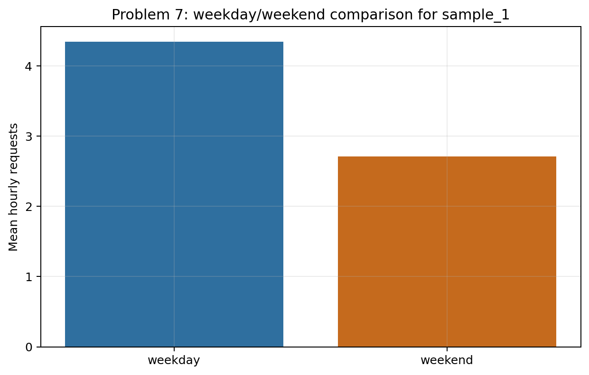
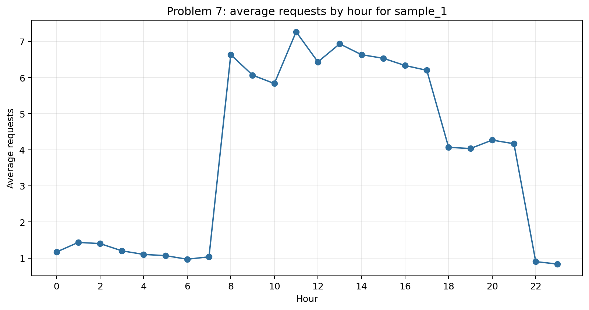
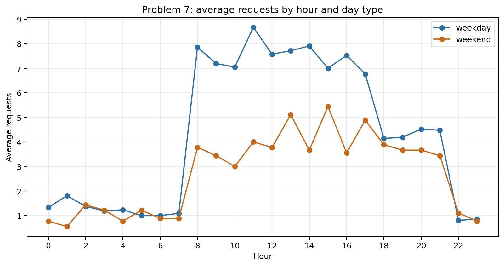
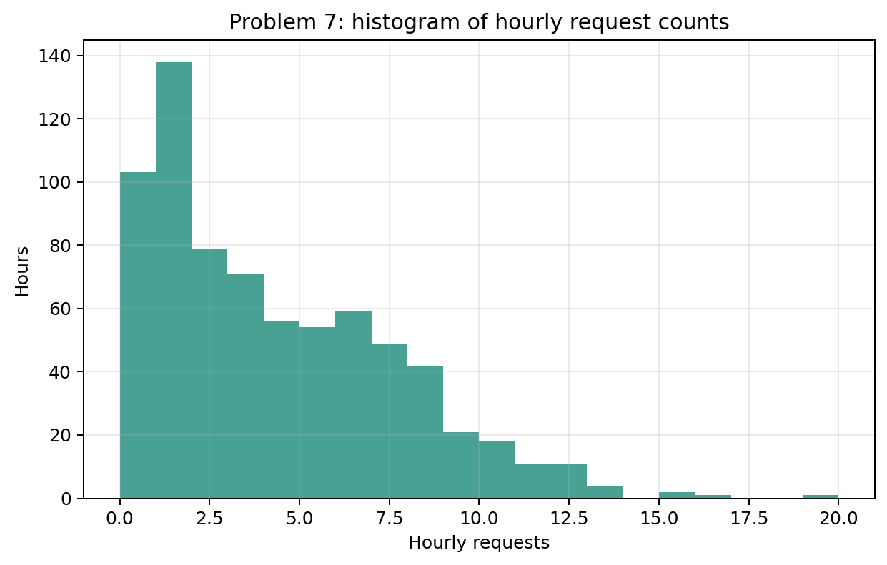
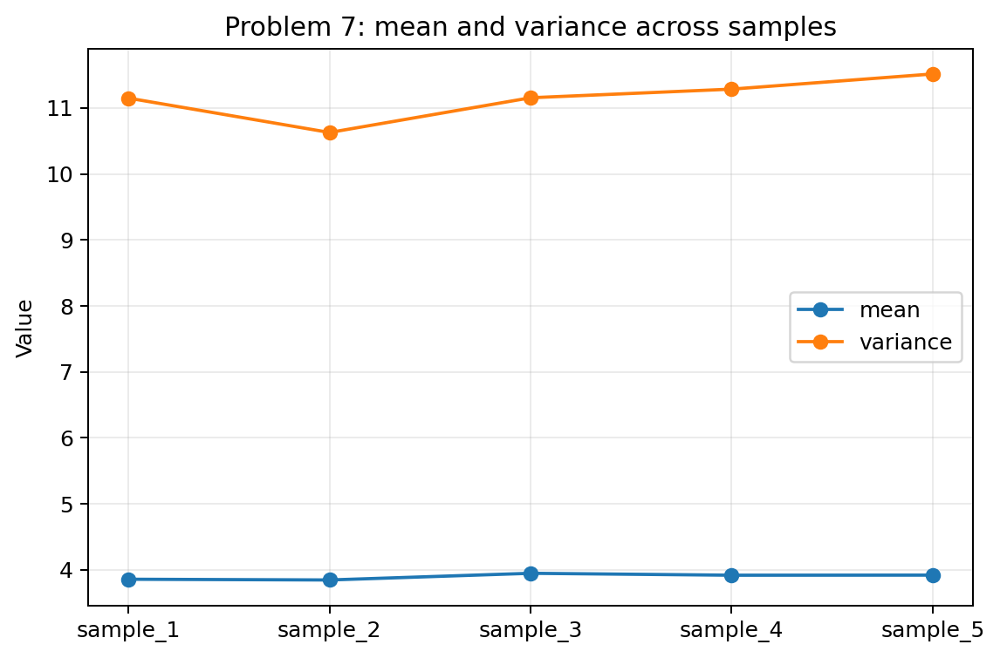

# Problem 7 — Call Center Requests Over Time

## Generated files

- Dataset: [`problem_07_call_center_requests.csv`](problem_07_call_center_requests.csv)
- Hourly summary for `sample_1`: [`hourly_requests_summary_sample_1.csv`](hourly_requests_summary_sample_1.csv)
- Day-type summary for `sample_1`: [`requests_summary_by_day_type_sample_1.csv`](requests_summary_by_day_type_sample_1.csv)
- Average by hour for `sample_1`: [`average_requests_by_hour_sample_1.csv`](average_requests_by_hour_sample_1.csv)
- Average by hour and day type: [`average_requests_by_hour_and_day_type_sample_1.csv`](average_requests_by_hour_and_day_type_sample_1.csv)
- Daily totals: [`daily_total_requests_sample_1.csv`](daily_total_requests_sample_1.csv)
- Mean and variance by sample: [`mean_variance_by_sample.csv`](mean_variance_by_sample.csv)
- Plots: PNG files in this folder.

## Visualizations

**What this shows:** This plot shows that weekday and weekend request volumes differ. It is evidence that the data should not be treated as one homogeneous count distribution.

**What this shows:** This line plot shows the daily traffic pattern. Request intensity changes strongly by hour, especially between night hours and business hours.

**What this shows:** This plot separates weekday and weekend patterns. It explains why one identical Poisson model for the whole dataset would be inappropriate.

**What this shows:** The histogram summarizes the distribution of hourly counts. Its shape is a mixture of low-rate and high-rate hours, not the shape of one constant-rate process.

**What this shows:** This plot compares the empirical mean and variance across samples. The difference between them supports the explanation that the data combine several traffic regimes.

## Description

One row represents one hour in one generated 30-day call-center sample. It records the date, day type, hour, and number of requests in that hour.

The main reproducible solution uses `sample_1`. The other samples show how count summaries fluctuate when the same time-dependent mechanism is sampled again.

## Hourly Count Summary for `sample_1`

| count | mean | variance | standard_deviation | minimum | median | maximum |
| --- | --- | --- | --- | --- | --- | --- |
| 720.0000 | 3.8542 | 11.1484 | 3.3389 | 0.0000 | 3.0000 | 19.0000 |

## Weekday and Weekend Comparison for `sample_1`

| day_type | hours | mean | variance | standard_deviation |
| --- | --- | --- | --- | --- |
| weekday | 504 | 4.3452 | 12.9700 | 3.6014 |
| weekend | 216 | 2.7083 | 5.0541 | 2.2481 |

## First Daily Totals for `sample_1`

| date | day_type | daily_total_requests |
| --- | --- | --- |
| 2026-03-01 | weekend | 57 |
| 2026-03-02 | weekday | 109 |
| 2026-03-03 | weekday | 90 |
| 2026-03-04 | weekday | 102 |
| 2026-03-05 | weekday | 124 |
| 2026-03-06 | weekday | 109 |
| 2026-03-07 | weekend | 61 |
| 2026-03-08 | weekend | 57 |
| 2026-03-09 | weekday | 106 |
| 2026-03-10 | weekday | 109 |

The full daily-total table is saved as CSV.

## Answers and Interpretation

The dataset is related to the Poisson distribution because each row records a count of events in a fixed time interval, one hour. For a simple Poisson model with a constant rate, the mean and variance would be approximately equal.

However, the whole dataset should not be treated as one identical Poisson distribution. The expected request rate changes by hour and by day type. Business hours have more requests than night hours, and weekdays differ from weekends. Mixing several different rates creates a heterogeneous count distribution.

The line plots show the most important structure: request intensity is strongly time-dependent.

## Mean, Variance, and Sample Variation

Across samples, the exact mean and variance change, but the main pattern remains stable. The variance is larger than the mean because the data combine different traffic regimes.

| sample_id | mean | variance | standard_deviation | variance_minus_mean |
| --- | --- | --- | --- | --- |
| sample_1 | 3.8542 | 11.1484 | 3.3389 | 7.2942 |
| sample_2 | 3.8431 | 10.6276 | 3.2600 | 6.7846 |
| sample_3 | 3.9444 | 11.1541 | 3.3398 | 7.2096 |
| sample_4 | 3.9153 | 11.2849 | 3.3593 | 7.3696 |
| sample_5 | 3.9167 | 11.5146 | 3.3933 | 7.5979 |
