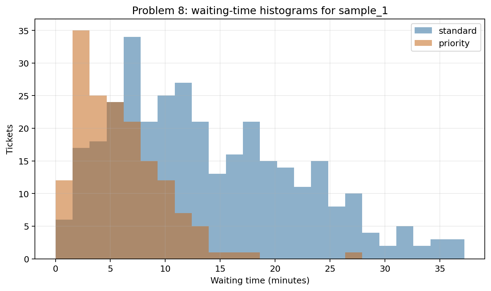
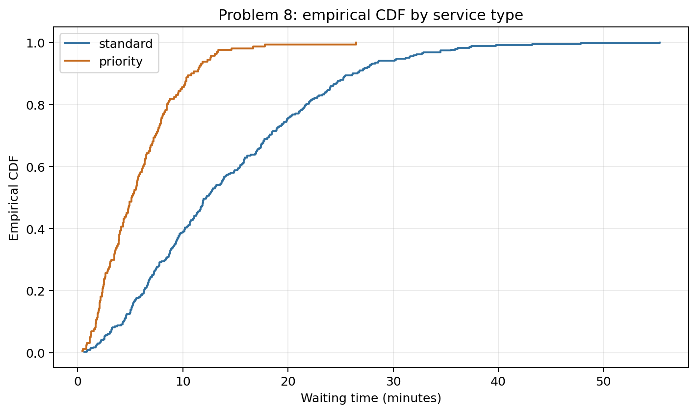
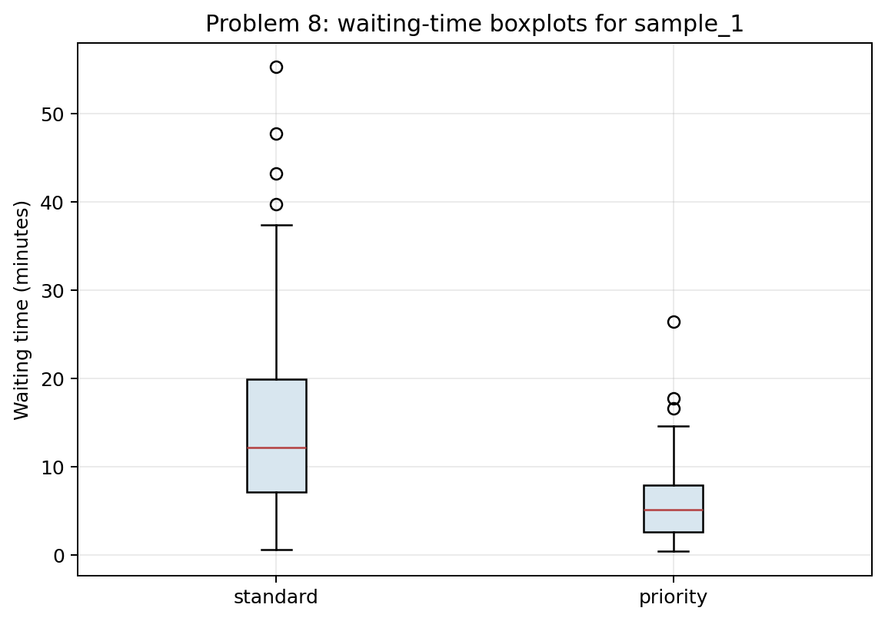
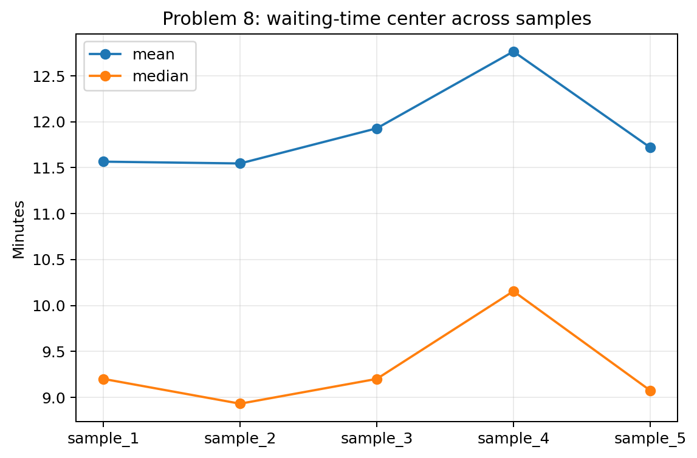

# Problem 8 — Waiting Times and Empirical CDF

## Generated files

- Dataset: [`problem_08_waiting_times.csv`](problem_08_waiting_times.csv)
- Overall summary for `sample_1`: [`waiting_time_summary_overall_sample_1.csv`](waiting_time_summary_overall_sample_1.csv)
- Service-type summary for `sample_1`: [`waiting_time_summary_by_service_type_sample_1.csv`](waiting_time_summary_by_service_type_sample_1.csv)
- ECDF probability estimates: [`ecdf_probability_estimates_sample_1.csv`](ecdf_probability_estimates_sample_1.csv)
- Quantiles by service type: [`waiting_time_quantiles_by_service_type_sample_1.csv`](waiting_time_quantiles_by_service_type_sample_1.csv)
- Summary by sample: [`waiting_time_summary_by_sample.csv`](waiting_time_summary_by_sample.csv)
- Histograms: [`waiting_time_histograms_by_service_type_sample_1.png`](waiting_time_histograms_by_service_type_sample_1.png)
- ECDF plot: [`waiting_time_ecdf_by_service_type_sample_1.png`](waiting_time_ecdf_by_service_type_sample_1.png)
- Boxplot: [`waiting_time_boxplot_by_service_type_sample_1.png`](waiting_time_boxplot_by_service_type_sample_1.png)
- Sample summary plot: [`waiting_time_summary_by_sample.png`](waiting_time_summary_by_sample.png)

## Visualizations

**What this shows:** The histograms show right-skewed waiting-time distributions. Priority tickets are concentrated at shorter waiting times, while standard tickets have a longer right tail.

**What this shows:** This is the main CDF plot. The priority curve rises faster, meaning a larger proportion of priority tickets are resolved below the same time threshold.

**What this shows:** The boxplot compares medians, interquartile ranges, and long waits. It supports the conclusion that priority service is faster not only on average but also across quantiles.

**What this shows:** This plot shows how mean and median waiting times change across samples. The exact values fluctuate, but the right-skew pattern remains visible because the mean tends to exceed the median.

## Description

One row represents one service ticket in one generated sample. It records whether the ticket was standard or priority, the waiting time, and whether it was resolved within 10 minutes.

The main reproducible solution uses `sample_1`. The other samples show how empirical CDF estimates and waiting-time summaries fluctuate.

## Overall Summary for `sample_1`

| count | mean | median | q1 | q3 | minimum | maximum | standard_deviation |
| --- | --- | --- | --- | --- | --- | --- | --- |
| 500.0000 | 11.5661 | 9.2000 | 5.0825 | 16.7275 | 0.4600 | 55.3400 | 8.7133 |

## Service-Type Summary for `sample_1`

| service_type | count | mean | median | q1 | q3 | standard_deviation | resolved_under_10_rate |
| --- | --- | --- | --- | --- | --- | --- | --- |
| priority | 160 | 5.8513 | 5.1250 | 2.6475 | 7.9425 | 3.9044 | 0.8562 |
| standard | 340 | 14.2555 | 12.2400 | 7.1850 | 19.9025 | 9.0519 | 0.3882 |

## Empirical CDF Estimates for `sample_1`

| quantity | estimate |
| --- | --- |
| P(waiting time <= 5) | 0.2440 |
| P(waiting time <= 10) | 0.5380 |
| P(waiting time > 20) | 0.1700 |

## Quantiles by Service Type for `sample_1`

| service_type | q10 | q25 | q50 | q75 | q90 |
| --- | --- | --- | --- | --- | --- |
| priority | 1.7670 | 2.6475 | 5.1250 | 7.9425 | 10.8410 |
| standard | 4.3940 | 7.1850 | 12.2400 | 19.9025 | 26.2060 |

## Answers and Interpretation

Waiting-time data are often right-skewed: many tickets are resolved quickly or moderately quickly, but some tickets wait much longer. The mean is therefore pulled upward relative to the median.

The empirical CDF estimates probabilities from the observed data. In `sample_1`, the empirical estimate of `P(waiting time <= 10)` is 0.5380, and the estimate of `P(waiting time > 20)` is 0.1700.

A histogram shows how observations are distributed across intervals. An empirical CDF shows, for each threshold, the proportion of observations at or below that threshold. This connects directly to the theoretical CDF, except that the empirical CDF is built from data.

Priority service has smaller quantiles than standard service, so priority tickets are usually resolved faster.

## Variation Across Samples

The exact means, medians, and ECDF probability estimates vary from sample to sample, but the priority-versus-standard ordering is stable.

| sample_id | mean | median | resolved_under_10_rate | probability_over_20 |
| --- | --- | --- | --- | --- |
| sample_1 | 11.5661 | 9.2000 | 0.5380 | 0.1700 |
| sample_2 | 11.5464 | 8.9300 | 0.5420 | 0.1500 |
| sample_3 | 11.9291 | 9.2000 | 0.5340 | 0.1720 |
| sample_4 | 12.7659 | 10.1550 | 0.4940 | 0.1960 |
| sample_5 | 11.7214 | 9.0750 | 0.5380 | 0.1600 |
