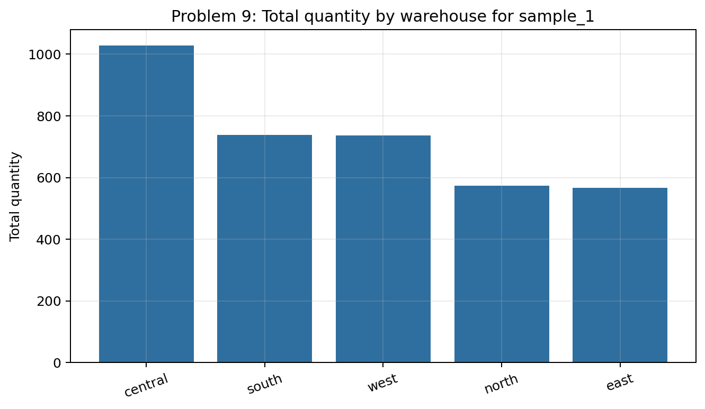
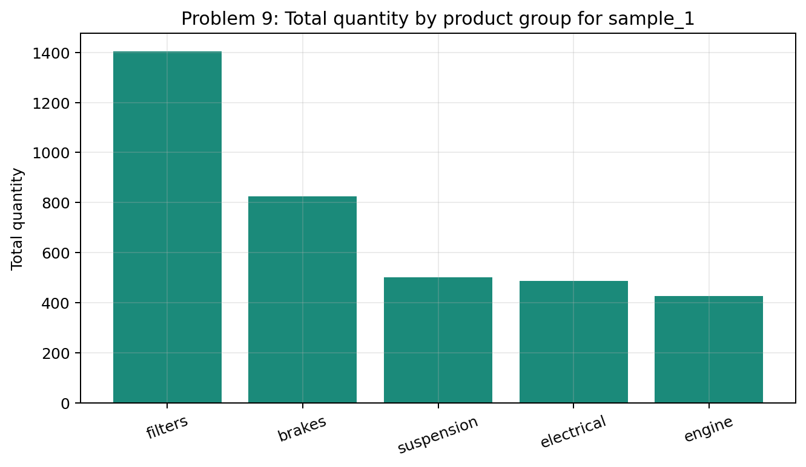
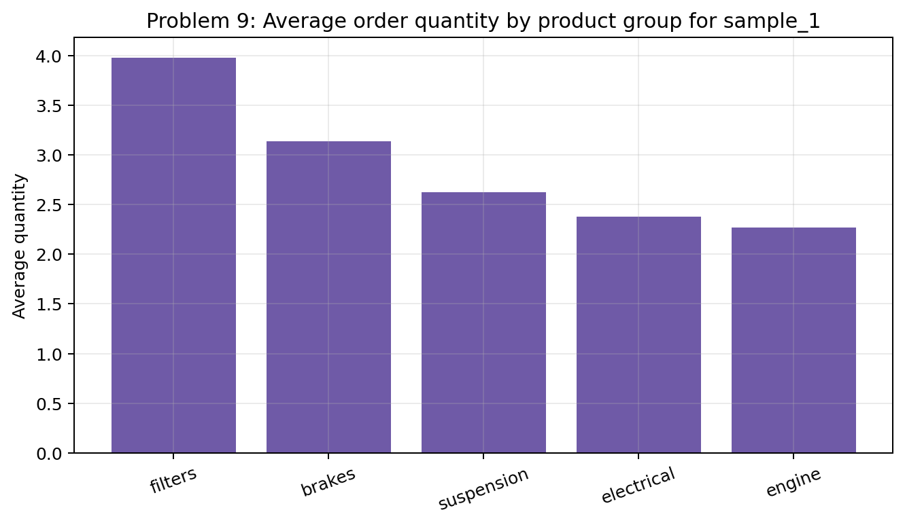
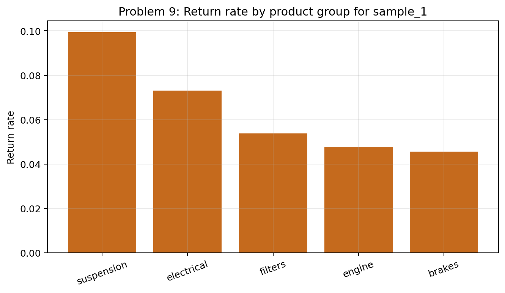
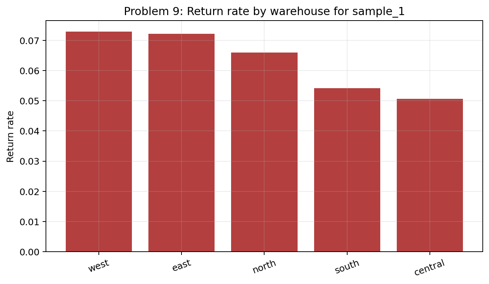
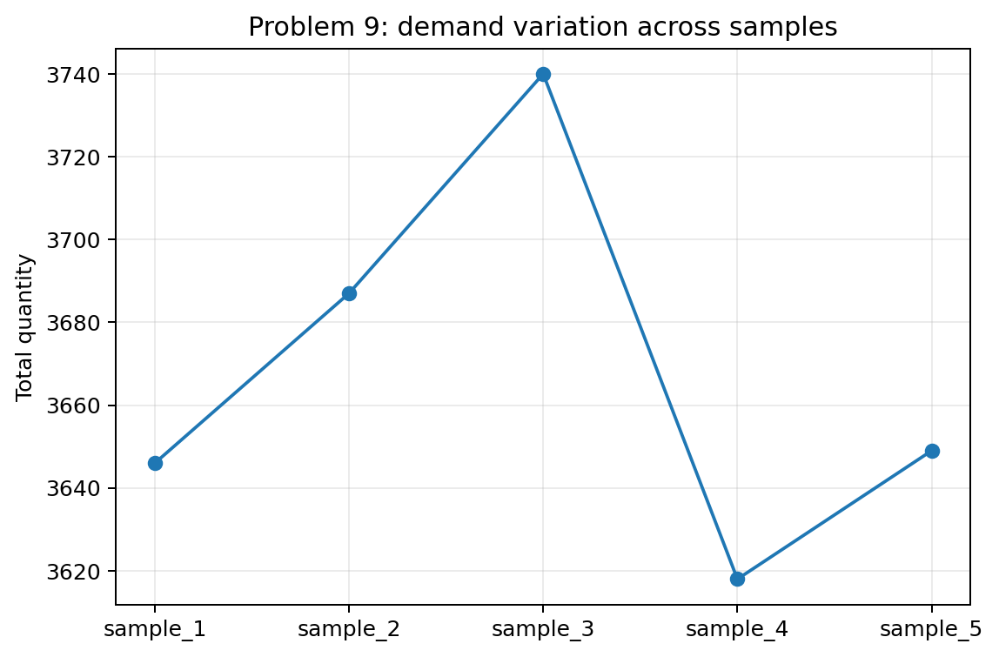

# Problem 9 — Warehouse Orders, Demand, and Returns

## Generated files

- Dataset: [`problem_09_warehouse_orders.csv`](problem_09_warehouse_orders.csv)
- Overall summary for `sample_1`: [`warehouse_orders_overall_summary_sample_1.csv`](warehouse_orders_overall_summary_sample_1.csv)
- Warehouse summary for `sample_1`: [`summary_by_warehouse_sample_1.csv`](summary_by_warehouse_sample_1.csv)
- Product-group summary for `sample_1`: [`summary_by_product_group_sample_1.csv`](summary_by_product_group_sample_1.csv)
- Daily totals: [`daily_total_quantity_sample_1.csv`](daily_total_quantity_sample_1.csv)
- Summary by sample: [`warehouse_orders_summary_by_sample.csv`](warehouse_orders_summary_by_sample.csv)
- Demand and return plots: PNG files in this folder.

## Visualizations

**What this shows:** This plot identifies which warehouses contribute most to total demand. It is useful for operational interpretation because totals matter more than line counts alone.

**What this shows:** This plot shows demand by product group. It supports the conclusion about which groups generate the highest demand.

**What this shows:** This plot separates order size from total demand. A product group can have high total demand because of many orders, large order sizes, or both.

**What this shows:** This plot focuses on return risk by product group. It should be interpreted separately from demand, because high demand and high return rate are different business questions.

**What this shows:** This plot checks whether return rates differ by warehouse. It helps identify whether returns are associated with location, not only product group.

**What this shows:** This plot shows sample-to-sample variation in total demand. It warns against treating one generated total as a fixed, exact value.

## Description

One row represents one warehouse order line in one generated sample. It records the warehouse, product group, ordered quantity, return indicator, and order date.

The main reproducible solution uses `sample_1`. The other samples show how demand totals and return rates fluctuate.

## Overall Summary for `sample_1`

| order_lines | total_quantity | average_quantity | returned_lines | return_rate |
| --- | --- | --- | --- | --- |
| 1200.0000 | 3646.0000 | 3.0383 | 74.0000 | 0.0617 |

## Warehouse Summary for `sample_1`

| warehouse | order_lines | total_quantity | average_quantity | returned_lines | return_rate |
| --- | --- | --- | --- | --- | --- |
| central | 336 | 1029 | 3.0625 | 17 | 0.0506 |
| east | 194 | 567 | 2.9227 | 14 | 0.0722 |
| north | 197 | 574 | 2.9137 | 13 | 0.0660 |
| south | 240 | 739 | 3.0792 | 13 | 0.0542 |
| west | 233 | 737 | 3.1631 | 17 | 0.0730 |

## Product-Group Summary for `sample_1`

| product_group | order_lines | total_quantity | average_quantity | returned_lines | return_rate |
| --- | --- | --- | --- | --- | --- |
| brakes | 263 | 825 | 3.1369 | 12 | 0.0456 |
| electrical | 205 | 488 | 2.3805 | 15 | 0.0732 |
| engine | 188 | 427 | 2.2713 | 9 | 0.0479 |
| filters | 353 | 1405 | 3.9802 | 19 | 0.0538 |
| suspension | 191 | 501 | 2.6230 | 19 | 0.0995 |

## Answers and Interpretation

The highest demand in `sample_1` is generated mainly by filters, brakes. Demand is best summarized with total quantity, while return problems are better summarized with return rates.

The overall return rate in `sample_1` is 0.0617. Return rates differ by product group and by warehouse, but these are empirical rates from one generated sample.

These empirical summaries differ from a theoretical probability model because they describe observed generated data. They estimate patterns in the sample, but they do not by themselves give the exact probability mechanism.

## Variation Across Samples

Total demand, average quantity, and return rates fluctuate across samples. The broad product-group demand pattern is usually stable, but exact totals and return rates should not be overinterpreted from one sample.

| sample_id | order_lines | total_quantity | average_quantity | return_rate |
| --- | --- | --- | --- | --- |
| sample_1 | 1200 | 3646 | 3.0383 | 0.0617 |
| sample_2 | 1200 | 3687 | 3.0725 | 0.0617 |
| sample_3 | 1200 | 3740 | 3.1167 | 0.0642 |
| sample_4 | 1200 | 3618 | 3.0150 | 0.0767 |
| sample_5 | 1200 | 3649 | 3.0408 | 0.0675 |
