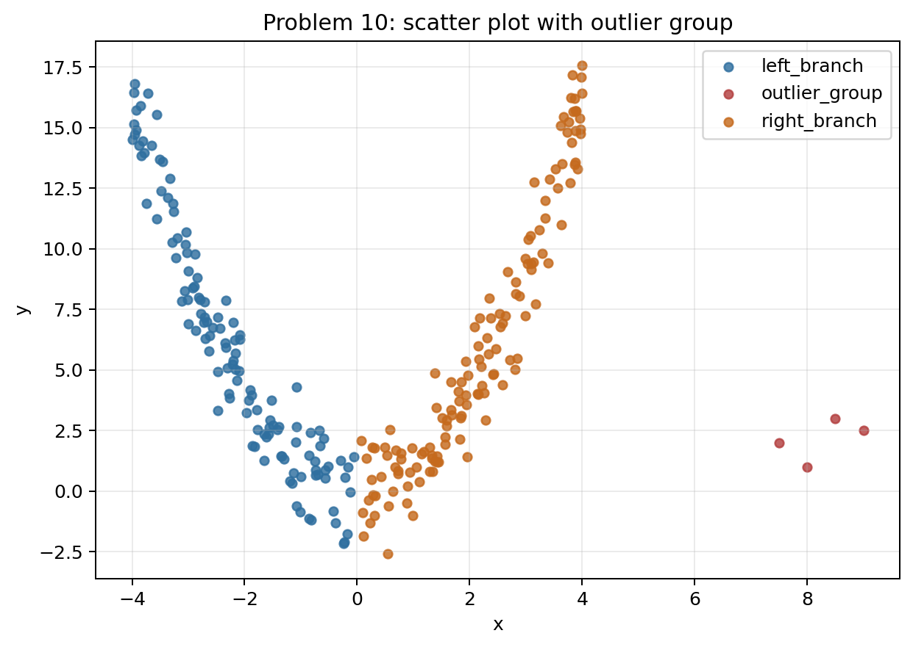
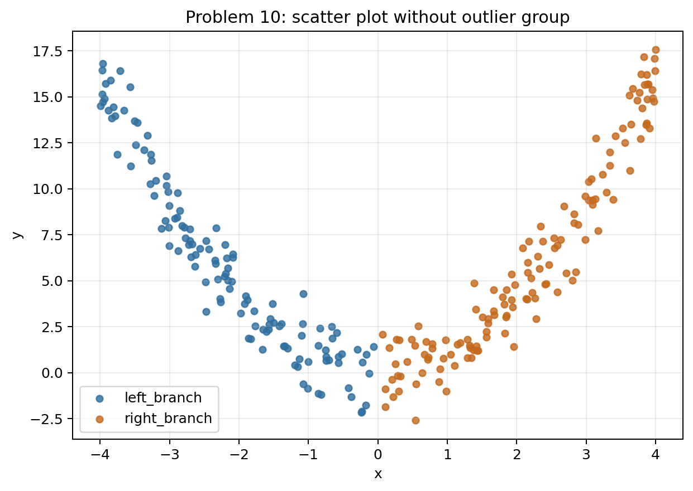
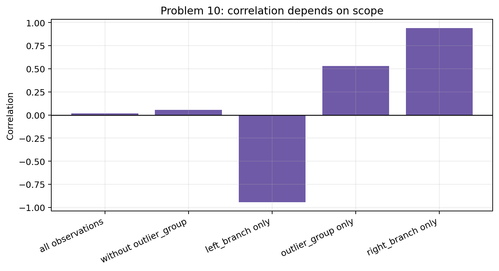
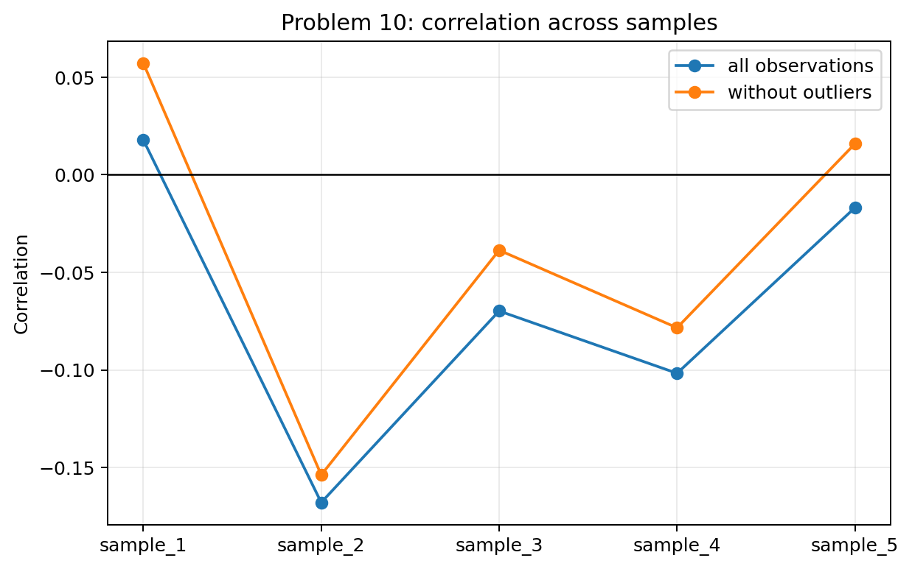

# Problem 10 — Correlation Traps

## Generated files

- Dataset: [`problem_10_correlation_traps.csv`](problem_10_correlation_traps.csv)
- Dataset without outlier group for `sample_1`: [`problem_10_without_outlier_group_sample_1.csv`](problem_10_without_outlier_group_sample_1.csv)
- Outlier observations for `sample_1`: [`outlier_group_observations_sample_1.csv`](outlier_group_observations_sample_1.csv)
- Correlation summary for `sample_1`: [`correlation_summary_sample_1.csv`](correlation_summary_sample_1.csv)
- Group summary for `sample_1`: [`summary_by_group_sample_1.csv`](summary_by_group_sample_1.csv)
- Correlation by sample: [`correlation_by_sample.csv`](correlation_by_sample.csv)
- Scatter with outliers: [`scatter_with_outliers_sample_1.png`](scatter_with_outliers_sample_1.png)
- Scatter without outliers: [`scatter_without_outliers_sample_1.png`](scatter_without_outliers_sample_1.png)
- Correlation by scope plot: [`correlation_by_scope_sample_1.png`](correlation_by_scope_sample_1.png)
- Correlation by sample plot: [`correlation_by_sample.png`](correlation_by_sample.png)

## Visualizations

**What this shows:** This scatter plot is the main evidence. It shows a strong U-shaped relationship even though the overall linear correlation is close to zero.

**What this shows:** After removing the outlier group, the nonlinear U-shape remains. This shows that the low overall correlation is not simply caused by the outliers.

**What this shows:** This plot shows that correlation depends heavily on which observations are included. The branches have strong correlations in opposite directions, while the combined data have weak correlation.

**What this shows:** This plot shows that exact correlation values change across samples. The visual nonlinear structure is more stable than the single numerical correlation.

## Description

One row represents one observation in one generated sample. It records two numerical variables, `x` and `y`, and a group label identifying the left branch, right branch, or outlier group.

The main reproducible solution uses `sample_1`. The other samples show how numerical correlation changes even when the nonlinear visual pattern stays the same.

## Correlation Summary for `sample_1`

| data_scope | observation_count | correlation |
| --- | --- | --- |
| all observations | 264 | 0.0179 |
| without outlier_group | 260 | 0.0572 |
| left_branch only | 125 | -0.9428 |
| outlier_group only | 4 | 0.5292 |
| right_branch only | 135 | 0.9405 |

## Group Summary for `sample_1`

| group | observation_count | mean_x | mean_y | min_x | max_x | min_y | max_y |
| --- | --- | --- | --- | --- | --- | --- | --- |
| left_branch | 125 | -2.1482 | 5.9510 | -3.9950 | -0.0630 | -2.1630 | 16.8040 |
| outlier_group | 4 | 8.2500 | 2.1250 | 7.5000 | 9.0000 | 1.0000 | 3.0000 |
| right_branch | 135 | 2.1446 | 6.0978 | 0.0690 | 3.9980 | -2.5950 | 17.5570 |

## Answers and Interpretation

The overall correlation in `sample_1` is close to zero, but the scatter plot clearly shows a strong U-shaped relationship. This is the main trap: correlation measures linear association, so it can fail to describe a nonlinear relationship.

Removing the outlier group changes the correlation, but it still does not make the U-shaped relationship well described by one linear coefficient. Within the left branch the relationship is strongly negative, and within the right branch it is strongly positive. The combined dataset hides both branch-level relationships.

A low correlation therefore does not necessarily mean that there is no relationship. It may mean that the relationship is nonlinear, that subgroups behave differently, or that outliers distort the linear summary.

## Variation Across Samples

The exact correlation changes from sample to sample. The visual U-shape remains stable, so the model solution should rely on the scatter plot together with the numerical correlation, not on the correlation coefficient alone.

| sample_id | correlation_all | correlation_without_outliers |
| --- | --- | --- |
| sample_1 | 0.0179 | 0.0572 |
| sample_2 | -0.1679 | -0.1537 |
| sample_3 | -0.0698 | -0.0386 |
| sample_4 | -0.1017 | -0.0784 |
| sample_5 | -0.0168 | 0.0159 |
